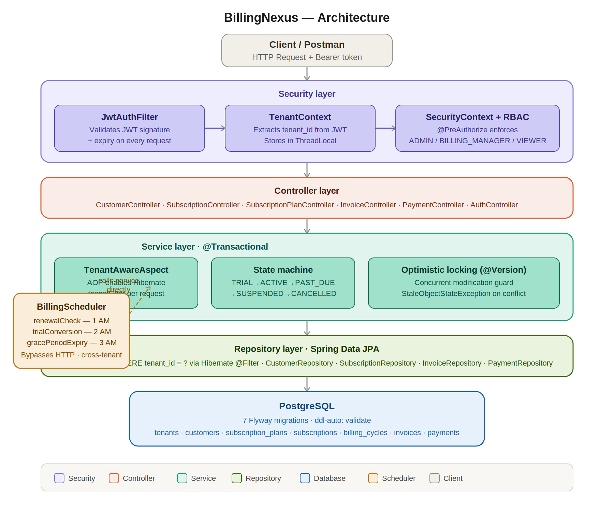

# BillingNexus

Multi-tenant enterprise subscription & billing management backend.

**Live:** https://billingnexus.onrender.com

## Architecture

## Tech Stack
- Java 21, Spring Boot 3.5
- PostgreSQL + Flyway (7 migrations)
- JWT + Spring Security + RBAC
- Hibernate @Filter for multi-tenancy
- Docker, deployed on Render

## API Endpoints
| Method | Endpoint | Role |
|---|---|---|
| POST | /api/auth/register | Public |
| POST | /api/auth/login | Public |
| POST | /api/plans | ADMIN |
| GET | /api/plans | All |
| POST | /api/customers | ADMIN, BILLING_MANAGER |
| POST | /api/subscriptions | ADMIN, BILLING_MANAGER |
| POST | /api/subscriptions/{id}/cancel | ADMIN, BILLING_MANAGER |
| GET | /api/invoices | All |
| POST | /api/payments | ADMIN, BILLING_MANAGER |
